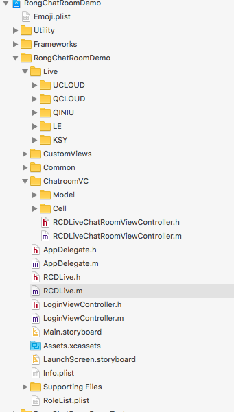
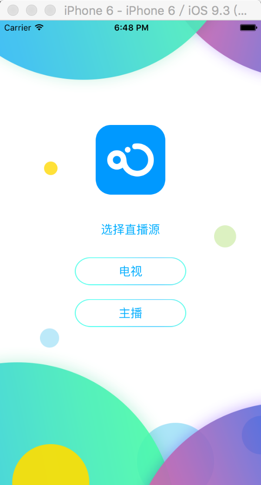
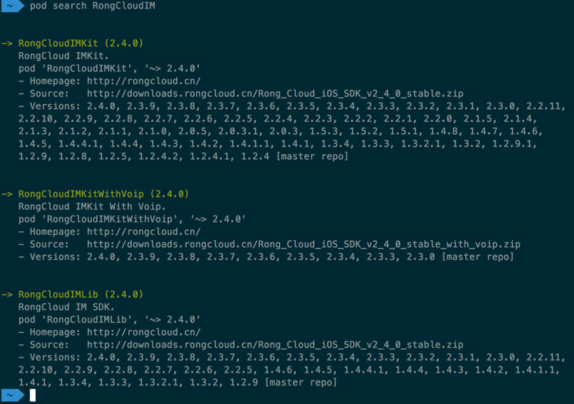
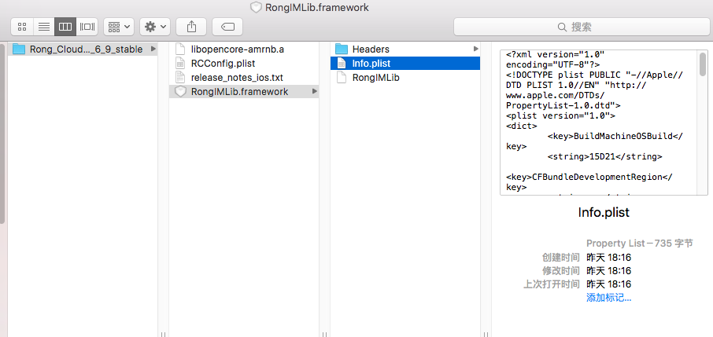
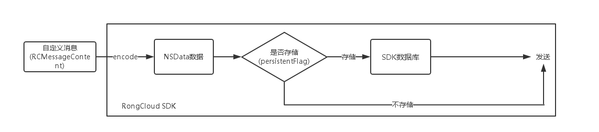
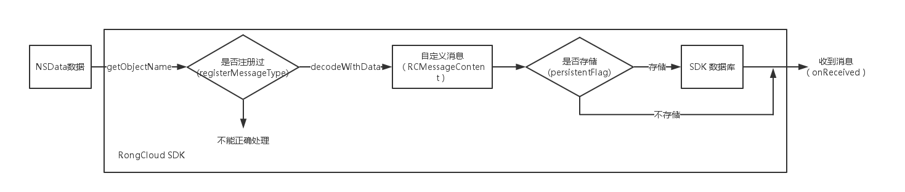

# iOS 直播聊天室 开发指南

## 基本概念

### 融云直播聊天室介绍

融云直播聊天室，是专门为视频直播业务提供的一个产品。主要特点是：

	1, 可以支持无人数上限的直播聊天室；
	2, 支持海量消息的并发，消息速度极快；
	3, 并可以方便的为直播聊天室实现弹幕、点赞、礼物、成员进入等消息通讯功能。
	
以上可以极大的节约视频直播产品的开发和运营成本。目前融云承担的日消息分发量峰值已经超过 1000 亿。

### 解决方案主要构成

融云的视频直播聊天室方案，由两部分构成，视频直播 SDK 和融云聊天室 SDK。后者由融云提供，前者你使用自己的推流和拉流来实现，或者使用第三方成熟的 SDK 来实现。融云的开源视频直播室 App 里整体方案为您打包了金山云视频 SDK，同时我们也支持七牛，乐视，阿里，UCldou等视频云 SDK。

* 视频直播 SDK
	* 主播端
	
		主播端使用的推流 SDK，主播需要把摄像头采集的视频源做编码，然后推到视频直播云上。
	
	* 观众端
	
		观众端使用的是拉流 SDK，观众需要的是把视频从服务端拉倒本地，做解码，并展示到手机终端上。观众端还必须包括一个视频播放器。
	
	您也可以把以上的主播端和观众端打包到同一个 App 里，同时提供主播推流功能，又提供观众端拉流观看的功能。融云直播聊天室对于以上几种模式的支持都是完全相同的。

* 融云聊天室 SDK
	* IMLib
		
		IMLib 是融云的 SDK 的一个产品组件，提供的是基础的通信能力，当使用融云聊天室的时候，您只需要简单调用初始化，连接，加入聊天室，发送消息等功能。	
	
	* 直播聊天室 App 开源代码
	
		基于融云的 IMlib SDK，融云把常见的视频直播聊天室的常用功能封装成了一个 App，Seal Live。在这个 App 内，融云实现了登录，连接，直播界面的显示，输入框，发送接收消息的处理流程，我们建议您直接使用这部分代码，可以大大的减轻整个聊天室 UI 的开发工作。
	

### 常见问题 Q&A

* 是否有系统瓶颈和任何数量限制？

	融云直播聊天室不存在任何系统瓶颈，系统可以实现平滑的横向扩展，支持任意规模的同时在线用户消息分发。

* 消息并发量过大是否会导致服务崩溃？

	当遇到直播高峰，用户数与消息量超出系统承载能力时，系统会自动根据预先设定的规则对消息进行抛弃，优先抛弃掉低优先级消息，确保系统能够稳定运行，不会影响用户体验。
	
* 什么是消息分级与消息抛弃模型

	当聊天室内人数众多，消息量会变得非常大，这时可能会出现服务端超过预设承载能力或者分发的消息量超过客户端消息接收能力的情况，这时，就需要引入消息分级机制。
	
	融云并没有对任何消息进行抛弃，但是在消息量极大的情况下，比如1万人到百万左右的聊天室内，消息并发量极大的情况下，每个用户端能收发到的消息和体验已经很悠闲，因此消息抛弃指的是确保用户端总是能收到最重要的消息，因此不重要的消息看起来就像是被抛弃了。	

	在开发过程中，除官方的普通文本消息之外，开发者需要针对不同的消息类别定义不同的消息类型，以便通过消息的 ObjectName 设置消息分级。目前融云支持两级消息分类，分别是高优先级消息和低优先级消息。当发生消息抛弃行为时，优先抛弃低优先级消息。

	针对主播的消息，可以通过聊天室内用户白名单机制，将主播添加到白名单以确保主播消息不会被抛弃掉。

	自定义消息文档请参见：http://www.rongcloud.cn/docs/android_architecture.html 和 http://www.rongcloud.cn/docs/ios_architecture.html 	
	
* 直播聊天室的成本结构是如何的？

	直播聊天室的成本结构主要包括两大部分：
	
	1、服务器成本：主要包括维持同时现在用户长连接的连接服务器成本和负责分发消息的消息服务器成本，还有极少量的基础功能服务器成本。
	
	2、流量成本：流量成本决定于系统最终分发的消息量和消息尺寸。为了降低成本，开发者在设计时要注意控制消息序列化之后的尺寸，也可以从业务角度优化消息量。注意：消息流量是 IDC 流量，与直播视频流使用的 CDN 流量成本有巨大差别，不可放在一起比较。

* 我还需要关注如何优化消息吗？

	是的。聊天室作为一种特殊的场景，其消息分发量是海量的，比如 1 万人的聊天室，如果实时在线的人每个人同时发送1条消息，那消息分发量就是 1万 X 1万 等于 1 亿的消息并发。因此您需要注意控制用户端发送消息的频率。比如常见的点赞消息，用户端可以非常快速的点赞，但建议你做成消息归并，每 1 秒再发送一条消息，每条点赞消息内携带一个数字，这个数字表示在 1 秒内该用户点赞了几次。这样可以大大减少消息并发量。


### 开始集成融云IM需要了解的概念
* appKey
* token
* userId
* 会话
	* conversationType
	* targetId
* 消息
	* 消息类型

## 融云IM是如何运转、如何与App交互的

使用融云IM聊天室之前，必须要先初始化SDK并建立与融云服务器的连接。


connect成功之后，融云提供两种加入聊天室的方式。

1. App Server创建聊天室，客户端调用joinExistChatRoom加入聊天室。


2. App Server只管理聊天室Id列表，客户端调用joinChatRoom加入聊天室，如果聊天室不存在则自动创建。


> 融云Sever API也提供了将用户加入聊天室的接口，但是不要通过此接口将普通用户加入聊天室中，否则会导致聊天室自动保活的功能失效。
> 一些记录功能的账号可以通过Server API /chatroom/join接口加入聊天室，但是普通用户需要调用SDK的joinExistChatRoom或joinExistChatRoom加入聊天室。

### App服务器端需要做什么？
* 管理用户体系和融云userId的映射关系
	
	> 融云不维护用户体系和好友关系，App需要为您用户体系中的每个用户和融云的userId建立一一对应的映射关系。之后就可以根据userId，加入、退出聊天室并收发消息。
	
* 实现从融云获取token的逻辑
* 根据App的产品逻辑，维护每个聊天室的信息和聊天室列表

### App服务器还可以做什么？
* 创建、销毁聊天室
* 查询聊天室的信息
* 查询聊天室中的用户列表
* 用户禁言、封禁
* 敏感词过滤
* 消息分级
* 全球节点

### App客户端需要做什么?
* 初始化SDK
* 加入、退出聊天室
* 初始化视频播放器（多家合作厂家可选）
* 收发消息
* 文字、表情、点赞、鲜花等编辑、显示
	
> 其中，App以上部分的功能和UI都已经实现并开源，可以开箱即用也可以随意定制。

### App客户端还可以做什么？
* 自定义任意消息及其显示样式（也可以不显示）
* 插入而不发送消息
* 监听消息收发，App可以按自己需求控制逻辑和UI
* 后期可以很方便地集成IMKit，快速扩展出单聊、群聊、黑名单、客服、VoIP等功能。

## iOS 直播聊天室Demo说明
* 源码结构

  

* AppDelegate
  
  在 AppDelegate 中初始化融云。
    
    [[RCDLive sharedRCDLive] initRongCloud:RONGCLOUD_IM_APPKEY];
* RCDLive

   管理融云核心类，所有与融云交互的接口调用以及消息监听都在这里实现
   如果您使用融云 IMkit UI库，可以设置成1 ，如果您的APP中只使用融云的底层通讯库 IMLib ，请把IsUseRongCloudIMKit 设置成 0（如果使用IMKit 引入 RongIMKit.Framework ，可以把 RCDLive.m 中注释掉的使用的 RongIMKit.Framework 中的相关类的代码放开）

* LoginViewController
  
  
  登录页面，Demo 中直接通过请求融云的服务器来获取用户的 Token ,实际开发过程中这个过程需要您的服务器来完成（这样可以避免泄露您的 APPkey 和 APPSecret），关于如何获取 Token 请参考 [如何获取Token](http://www.rongcloud.cn/docs/server.html#获取_Token_方法/ "Title")
  电视：播放器支持播放网络上的一些网络电视，具体参考对集成的视频播放器的厂商官方说明。
  主播：可以实时显示直播端的推流。（进入空白是因为主播推流端此时没有推流，推流Demo 可以参考直播厂商官方Demo）
  
* RCDLiveChatRoomViewController
  
  
  
  
* 播放器
  Demo 默认集成了金山播放器，同时还做了其他厂家播放器的集成，可以参考 Live 目录下的文件
  * UCLOUD （上海优刻得信息科技有限公司）
  * QCLOUD （腾讯）
  * QINIU （七牛）
  * LE （乐视）
  * KSY （金山）
  （目录中的类库由于体积大以及冲突的关系，已经去掉，部分代码也注释掉了，可以到对应厂家的官网下载添加即可）
* 收发消息
  RCDLive.m 里封装了收发消息的方法，如果使用的 IMKit 可以设置实现代理  RCIMReceiveMessageDelegate 参考 [IMKit 接收消息](http://www.rongcloud.cn/docs/ios.html#消息接收监听 "Title")
  如果使用的 IMLib 可以设置实现代理  RCIMClientReceiveMessageDelegate 参考 [IMLib 接收消息](http://www.rongcloud.cn/docs/ios_imlib.html#5_发送与接收消息 "Title")

* 消息显示
  Demo 除了实现了显示 SDK 中的文本消息 RCTextMessage 之外，还自定义了礼物消息  RCDLiveGiftMessage ，关于自定义消息请参考 [IMLib 自定义消息](http://www.rongcloud.cn/docs/ios_architecture.html#自定义消息"Title") 以及 [IMKit 自定义消息Cell](http://www.rongcloud.cn/docs/ios.html#自定义消息_Cell"Title")
* 用户信息（头像、名字）
  由于聊天室业务场景的特点，成员大多具有随机性，所有我们可以在发送消息的时候将用户信息（头像、名字）附加到消息里，在接收到消息的时候再将用户信息解析出来。
  融云所有的消息继承自 RCMessageContent 类，类里有发送这信息的属性 senderUserInfo ，在新建消息发送的时候可以给这个信息附上当前登录用户的信息。
  `` messageContent.senderUserInfo = currentUserInfo;
  ``
  
  自定义消息在实现的 encode 方法中要将 senderUserInfo 序列化到消息中，参考 Demo 中 RCDLiveGiftMessage 消息的实现。
  在 decodeWithData 方法中 调用 [self decodeUserInfo:userinfoDic];对 senderUserInfo 解析
  在 encode 方法中，需要将 senderUserInfo 序列化到 Json 数据中

## 聊天室集成指南

### 集成SDK
融云开源的直播聊天室基于IMLib实现，有两种方式可以将SDK导入您的项目中。

* 通过CocoaPods管理依赖
* 手动导入SDK并管理依赖
	
> CocoaPods是目前最流行的Cocoa项目库依赖管理工具之一，考虑到便捷与项目的可维护性，我们更推荐您使用CocoaPods导入并管理SDK。

#### 使用 CocoaPods 导入 SDK
1. CocoaPods 安装

	如果您的机器上已经安装了 CocoaPods，直接进入下一步即可。
	
	如果您的网络已经翻墙，在终端中运行如下命令直接安装：
	
	```shell
		sudo gem install cocoapods
	```
	
	如果您的网络不能翻墙，可以通过淘宝的 RubyGems镜像 进行安装。
	
	在终端依次运行以下命令：
	
	```shell
		gem sources --add https://ruby.taobao.org/ --remove https://rubygems.org/
		sudo gem install cocoapods
	```

2. 查询 CocoaPods 源中的融云 SDK

	在终端中运行以下命令：
	
	```
		pod search RongCloudIM
	```
	
	
	
	如果运行以上命令，没有搜到融云的 SDK 或者搜不到最新的 SDK 版本，您可以运行以下命令，更新一下您本地的 CocoaPods 源列表。
	
	```shell
		pod repo update
	```
	
	您可以看到，融云在 CocoaPods 上提供了三种 SDK 下载，IMLib、不包含VoIP功能的 IMKit、包含 VoIP 功能的 IMKit。
	
	直播聊天室Demo使用IMlib。
	
3. 使用 CocoaPods 导入融云 SDK

	打开终端，进入到您的工程目录，执行以下命令，会自动生成一个Podfile文件。
	
	```shell
		pod init
	```
	
	打开Podfile，在您项目的target下加入以下内容。（在此以2.4.0版本为例）
	
	```
		pod 'RongCloudIMLib', '2.4.0'
	```
	
	然后在终端中运行以下命令：
	
	```shell
		pod install
	```
	
	完成后，CocoaPods 会在您的工程根目录下生成一个 .xcworkspace 文件。您需要通过此文件打开您的工程，而不是之前的 .xcodeproj。
	
4. 设置 App 支持 http

	iOS 9 中，Apple 引入了新特性 App Transport Security (ATS)，默认要求 App 必须使用 https 协议。详情：[What's New in iOS 9.0](https://developer.apple.com/library/prerelease/ios/releasenotes/General/WhatsNewIniOS/Articles/iOS9.html#//apple_ref/doc/uid/TP40016198-DontLinkElementID_13)
	
	融云 SDK 在 iOS9 上需要使用 http，您需要设置在 App 中使用 http。
	
	1. 在 App 的 Info.plist 中添加 NSAppTransportSecurity 类型Dictionary。
	2. 在 NSAppTransportSecurity 下添加 NSAllowsArbitraryLoads 类型 Boolean，值设为 YES。

##### CocoaPods 使用说明
* 指定SDK版本
	CocoaPods 中，有几种设置 SDK 版本的方法。如：
	* '>= 2.4.X' 会根据您本地的 CocoaPods 源列表，导入不低于 2.4.X 版本的 SDK。
	* '~> 2.4.X' 会根据您本地的 CocoaPods 源列表，介于 2.4.X~2.5.0 之前版本的 SDK。
	
	我们建议您锁定版本，便于团队开发。如，指定 2.4.X 版本。
	
	```shell
		pod 'RongCloudIMKit', '2.4.X'
	```
	
* 升级本地CocoaPods源

	CocoaPods有一个中心化的源，默认本地会缓存CocoaPods源服务器上的所有SDK版本。
	
	如果搜索的时候没有搜到融云的 SDK 或者搜不到最新的 SDK 版本，可以执行以下命令更新一下本地的缓存。
	
	```shell
		pod repo update
	```
	
* 升级工程的SDK版本

	更新您工程目录中 Podfile 指定的 SDK 版本后，在终端中执行以下命令。
	
	```shell
		pod update
	```
	
* 清楚Cocoapods本地缓存

	特殊情况下，由于网络或者别的原因，通过 CocoaPods 下载的文件可能会有问题。
	
	这时候您可以删除 CocoaPods 的缓存(~/Library/Caches/CocoaPods/Pods/Release 目录)，再次导入即可。
	
* 查看当前使用的 SDK 版本

	您可以在 Podfile.lock 文件中看到您工程中使用的 SDK 版本。
	
	> 关于 CocoaPods 的更多内容，您可以参考 [CocoaPods 文档](https://cocoapods.org/)

#### 手动导入SDK
1. 下载SDK

	您可以到 [融云官方网站](http://www.rongcloud.cn/downloads) 下载融云 SDK。
	
2. 导入SDK

	SDK 文件说明
	
	下载的 SDK 中包含以下文件：
	
	
	
	文件                   | 说明                 | 注意事项
	:---------------------|:---------------------|:----------
	RongIMLib.framework   | IMlib的framework库    | 必须导入
	libopencore-amrnb.a   | 第三方开源语音库        | 必须导入
	RCConfig.plist        | 有特殊定制需求的用户使用 | 可选，一般用户不需要导入
	release_notes_ios.txt | 版本变更的说明文档      | 仅说明，非工程必须文件
	
3. 添加系统库依赖

	您除了在工程中导入 SDK 之前，还需要添加如下系统库的引用。
	
	* AssetsLibrary.framework
	* AudioToolbox.framework
	* AVFoundation.framework
	* CFNetwork.framework
	* CoreAudio.framework
	* CoreGraphics.framework
	* CoreLocation.framework
	* CoreMedia.framework
	* CoreTelephony.framework
	* CoreVideo.framework
	* ImageIO.framework
	* libc++.tbd
	* libc++abi.tbd
	* libsqlite3.tbd
	* libstdc++.tbd
	* libxml2.tbd
	* libz.tbd
	* MapKit.framework
	* OpenGLES.framework
	* QuartzCore.framework
	* SystemConfiguration.framework
	* UIKit.framework
	* Photos.framework
	
4. 设置 App 支持 http

	iOS 9 中，Apple 引入了新特性 App Transport Security (ATS)，默认要求 App 必须使用 https 协议。详情：[What's New in iOS 9.0](https://developer.apple.com/library/prerelease/ios/releasenotes/General/WhatsNewIniOS/Articles/iOS9.html#//apple_ref/doc/uid/TP40016198-DontLinkElementID_13)
	
	融云 SDK 在 iOS9 上需要使用 http，您需要设置在 App 中使用 http。
	
	1. 在 App 的 Info.plist 中添加 NSAppTransportSecurity 类型Dictionary。
	2. 在 NSAppTransportSecurity 下添加 NSAllowsArbitraryLoads 类型 Boolean，值设为 YES。
	
5. 查看当前使用的 SDK 版本

	手动导入的 SDK 版本，在 Folder 中打开 RongIMLib.framework， 该目录下有一个 Info.plist 文件，打开即可看见版本号。
	
	
	
	
### 初始化
 
在您需要使用融云 SDK 功能的类中，import 相关头文件。

```objc
	#import <RongIMLib/RongIMLib.h>
```

请使用您之前从融云开发者控制台注册得到的 App Key，通过RCIMClient的单例，传入 initWithAppKey: 方法，初始化 SDK。 

您在使用融云 SDK 所有功能之前，您必须先调用此方法初始化 SDK。 在 App 的整个生命周期中，您只需要将 SDK 初始化一次。

```objc
	[[RCIMClient sharedRCIMClient] initWithAppKey:@"YourTestAppKey"];
```

### 获取Token

Token 即用户令牌，相当于您 APP 上当前用户连接融云的身份凭证。 

在您连接融云服务器之前，您需要请求您的 App Server，您的 App Server 通过 Server API 获取 Token 并返回给您的客户端，客户端获取到这个 Token 即可进入下一步连接融云服务器。

* 为什么必须在服务器端请求 Token，客户端不提供获取 Token 的接口？

因为获取 Token 时需要提供 App Key 和 App Secret 。如果在客户端请求 Token，假如您的 App 代码一旦被反编译，则会导致您的 App Key 和 App Secret 泄露。所以，务必在您的服务器端获取 Token。

我们在开发者控制台提供了 API 调试的功能，在开发初期阶段，您可以通过其中获取 Token 功能，手动获取 Token 进行测试。

### 登录
将您在上一步获取到的 Token，通过 RCIMClient 的单例，传入 -connectWithToken:success:error:tokenIncorrect: 方法，即可建立与服务器的连接。

在 App 整个生命周期，您只需要调用一次此方法与融云服务器建立连接。之后无论是网络出现异常或者 App 有前后台的切换等，SDK 都会负责自动重连。

SDK 针对 iOS 的前后台和各种网络状况，进行了连接和重连机制的优化，建议您调用一次 connectWithToken 即可，其余交给 SDK 处理。 除非您已经手动将连接断开，否则您不需要自己再手动重连。

```objc
	// RCIMClient Class
	
	/*!
	 与融云服务器建立连接
	
	 @param token                   从您服务器端获取的token(用户身份令牌)
	 @param successBlock            连接建立成功的回调
	 [userId:当前连接成功所用的用户ID]
	 @param errorBlock              连接建立失败的回调 [status:连接失败的错误码]
	 @param tokenIncorrectBlock     token错误或者过期的回调
	
	 @discussion 在App整个生命周期，您只需要调用一次此方法与融云服务器建立连接。
	 之后无论是网络出现异常或者App有前后台的切换等，SDK都会负责自动重连。
	 除非您已经手动将连接断开，否则您不需要自己再手动重连。
	
	 tokenIncorrectBlock有两种情况：
	 一是token错误，请您检查客户端初始化使用的AppKey和您服务器获取token使用的AppKey是否一致；
	 二是token过期，是因为您在开发者后台设置了token过期时间，您需要请求您的服务器重新获取token并再次用新的token建立连接。
	
	 @warning 如果您使用IMLib，请使用此方法建立与融云服务器的连接；
	 如果您使用IMKit，请使用RCIM中的同名方法建立与融云服务器的连接，而不要使用此方法。
	
	 在tokenIncorrectBlock的情况下，您需要请求您的服务器重新获取token并建立连接，但是注意避免无限循环，以免影响App用户体验。
	
	 此方法的回调并非为原调用线程，您如果需要进行UI操作，请注意切换到主线程。
	 */
	- (void)connectWithToken:(NSString *)token
	                 success:(void (^)(NSString *userId))successBlock
	                   error:(void (^)(RCConnectErrorCode status))errorBlock
	          tokenIncorrect:(void (^)())tokenIncorrectBlock;
```

### 加入聊天室
用户需要加入聊天室之后，才能在聊天室里面接收和发送消息。

SDK提供了两个加入聊天室的接口：

1. 只加入已经存在的聊天室，如果聊天室不存在则失败
2. 加入聊天室，如果聊天室不存在，会自动创建并加入聊天室

您可以根据您的App逻辑选择使用。

```objc
	// RCIMClient Class
	
	/*!
	 加入聊天室（如果聊天室不存在则会创建）
	
	 @param targetId                聊天室ID
	 @param messageCount 进入聊天室时获取历史消息的数量，-1<=messageCount<=50
	 @param successBlock            加入聊天室成功的回调
	 @param errorBlock              加入聊天室失败的回调
	 [status:加入聊天室失败的错误码]
	
	 @discussion
	 可以通过传入的messageCount设置加入聊天室成功之后，需要获取的历史消息数量。
	 -1表示不获取任何历史消息，0表示不特殊设置而使用SDK默认的设置（默认为获取10条），0<messageCount<=50为具体获取的消息数量,最大值为50。
	 */
	- (void)joinChatRoom:(NSString *)targetId
	        messageCount:(int)messageCount
	             success:(void (^)())successBlock
	               error:(void (^)(RCErrorCode status))errorBlock;
	
	/*!
	 加入已经存在的聊天室（如果不存在或超限会返回聊天室不存在错误23410 或 人数超限
	 23411）
	
	 @param targetId                聊天室ID
	 @param messageCount 进入聊天室时获取历史消息的数量，-1<=messageCount<=50
	 @param successBlock            加入聊天室成功的回调
	 @param errorBlock              加入聊天室失败的回调
	 [status:加入聊天室失败的错误码]
	
	 @warning
	 注意：使用Kit库的会话页面viewDidLoad会自动调用joinChatRoom加入聊天室（聊天室不存在会自动创建），
	 如果您只想加入已存在的聊天室，需要在push到会话页面之前调用这个方法并且messageCount
	 传-1，成功之后push到会话页面，失败需要您做相应提示处理
	
	 @discussion
	 可以通过传入的messageCount设置加入聊天室成功之后，需要获取的历史消息数量。
	 -1表示不获取任何历史消息，0表示不特殊设置而使用SDK默认的设置（默认为获取10条），0<messageCount<=50为具体获取的消息数量,最大值为50。
	 */
	- (void)joinExistChatRoom:(NSString *)targetId
	             messageCount:(int)messageCount
	                  success:(void (^)())successBlock
	                    error:(void (^)(RCErrorCode status))errorBlock;
```

### 退出聊天室
用户退出聊天室之后，就不再收到该聊天室的消息。

```objc
	// RCIMClient Class
	
	/*!
	 退出聊天室
	
	 @param targetId                聊天室ID
	 @param successBlock            退出聊天室成功的回调
	 @param errorBlock              退出聊天室失败的回调
	 [status:退出聊天室失败的错误码]
	 */
	- (void)quitChatRoom:(NSString *)targetId
	             success:(void (^)())successBlock
	               error:(void (^)(RCErrorCode status))errorBlock;
```

### 发送消息
加入了聊天室之后，就可以发送消息。

SDK提供以下接口，用于发送文本、语音、自定义等消息。

如果您是在聊天室中发送消息，则conversationType设置为ConversationType_CHATROOM，pushContent和pushData可以设置为nil（因为聊天室没有消息推送）。

```objc
	// RCIMClient Class
	
	/*!
	 发送消息
	
	 @param conversationType    发送消息的会话类型
	 @param targetId            发送消息的目标会话ID
	 @param content             消息的内容
	 @param pushContent         接收方离线时需要显示的远程推送内容
	 @param pushData            接收方离线时需要在远程推送中携带的非显示数据
	 @param successBlock        消息发送成功的回调 [messageId:消息的ID]
	 @param errorBlock          消息发送失败的回调 [nErrorCode:发送失败的错误码,
	 messageId:消息的ID]
	 @return                    发送的消息实体
	
	 @discussion 当接收方离线并允许远程推送时，会收到远程推送。
	 远程推送中包含两部分内容，一是pushContent，用于显示；二是pushData，用于携带不显示的数据。
	
	 SDK内置的消息类型，如果您将pushContent和pushData置为nil，会使用默认的推送格式进行远程推送。
	 自定义类型的消息，需要您自己设置pushContent和pushData来定义推送内容，否则将不会进行远程推送。
	
	 如果您使用此方法发送图片消息，需要您自己实现图片的上传，构建一个RCImageMessage对象，
	 并将RCImageMessage中的imageUrl字段设置为上传成功的URL地址，然后使用此方法发送。
	
	 @warning 如果您使用IMLib，可以使用此方法发送消息；
	 如果您使用IMKit，请使用RCIM中的同名方法发送消息，否则不会自动更新UI。
	 */
	- (RCMessage *)sendMessage:(RCConversationType)conversationType
	                  targetId:(NSString *)targetId
	                   content:(RCMessageContent *)content
	               pushContent:(NSString *)pushContent
	                  pushData:(NSString *)pushData
	                   success:(void (^)(long messageId))successBlock
	                     error:(void (^)(RCErrorCode nErrorCode,
	                                     long messageId))errorBlock;
```

SDK还提供以下接口，用于发送图片消息。

如果您是在聊天室中发送图片消息，则conversationType设置为ConversationType_CHATROOM，pushContent和pushData可以设置为nil（因为聊天室没有消息推送）。

```objc
	// RCIMClient Class
	
	/*!
	 发送图片消息
	
	 @param conversationType    发送消息的会话类型
	 @param targetId            发送消息的目标会话ID
	 @param content             消息的内容
	 @param pushContent         接收方离线时需要显示的远程推送内容
	 @param pushData            接收方离线时需要在远程推送中携带的非显示数据
	 @param progressBlock       消息发送进度更新的回调 [progress:当前的发送进度, 0
	 <= progress <= 100, messageId:消息的ID]
	 @param successBlock        消息发送成功的回调 [messageId:消息的ID]
	 @param errorBlock          消息发送失败的回调 [errorCode:发送失败的错误码,
	 messageId:消息的ID]
	 @return                    发送的消息实体
	
	 @discussion 当接收方离线并允许远程推送时，会收到远程推送。
	 远程推送中包含两部分内容，一是pushContent，用于显示；二是pushData，用于携带不显示的数据。
	
	 SDK内置的消息类型，如果您将pushContent和pushData置为nil，会使用默认的推送格式进行远程推送。
	 自定义类型的消息，需要您自己设置pushContent和pushData来定义推送内容，否则将不会进行远程推送。
	
	 如果您需要上传图片到自己的服务器，构建一个RCImageMessage对象，
	 并将RCImageMessage中的imageUrl字段设置为上传成功的URL地址，然后使用RCIMClient的
	 sendMessage:targetId:content:pushContent:pushData:success:error:方法
	 或sendMessage:targetId:content:pushContent:success:error:方法进行发送，不要使用此方法。
	
	 @warning 如果您使用IMKit，使用此方法发送图片消息SDK会自动更新UI；
	 如果您使用IMLib，请使用RCIMClient中的同名方法发送图片消息，不会自动更新UI。
	 */
	- (RCMessage *)
	sendImageMessage:(RCConversationType)conversationType
	        targetId:(NSString *)targetId
	         content:(RCMessageContent *)content
	     pushContent:(NSString *)pushContent
	        pushData:(NSString *)pushData
	        progress:(void (^)(int progress, long messageId))progressBlock
	         success:(void (^)(long messageId))successBlock
	           error:(void (^)(RCErrorCode errorCode, long messageId))errorBlock;
```

### 监听消息接收
SDK提供消息接收的监听接口。

```objc
	// RCIMClient Class
	
	/*!
	 设置IMlib的消息接收监听器
	
	 @param delegate    IMLib消息接收监听器
	 @param userData    用户自定义的监听器Key值，可以为nil
	
	 @discussion
	 设置IMLib的消息接收监听器请参考RCIMClient的setReceiveMessageDelegate:object:方法。
	
	 userData为您自定义的任意数据，SDK会在回调的onReceived:left:object:方法中传入作为object参数。
	 您如果有设置多个监听，会只有最终的一个监听器起作用，您可以通过该userData值区分您设置的监听器。如果不需要直接设置为nil就可以。
	
	 @warning 如果您使用IMlib，可以设置并实现此Delegate监听消息接收；
	 如果您使用IMKit，请使用RCIM中的receiveMessageDelegate监听消息接收，而不要使用此方法，否则会导致IMKit中无法自动更新UI！
	 */
	- (void)setReceiveMessageDelegate:(id<RCIMClientReceiveMessageDelegate>)delegate
	                           object:(id)userData;
	
	/*!
	 IMlib消息接收的监听器
	
	 @discussion
	 设置IMLib的消息接收监听器请参考RCIMClient的setReceiveMessageDelegate:object:方法。
	
	 @warning 如果您使用IMlib，可以设置并实现此Delegate监听消息接收；
	 如果您使用IMKit，请使用RCIM中的RCIMReceiveMessageDelegate监听消息接收，而不要使用此监听器，否则会导致IMKit中无法自动更新UI！
	 */
	@protocol RCIMClientReceiveMessageDelegate <NSObject>
	
	/*!
	 接收消息的回调方法
	
	 @param message     当前接收到的消息
	 @param nLeft       还剩余的未接收的消息数，left>=0
	 @param object      消息监听设置的key值
	
	 @discussion 如果您设置了IMlib消息监听之后，SDK在接收到消息时候会执行此方法。
	 其中，left为还剩余的、还未接收的消息数量。比如刚上线一口气收到多条消息时，通过此方法，您可以获取到每条消息，left会依次递减直到0。
	 您可以根据left数量来优化您的App体验和性能，比如收到大量消息时等待left为0再刷新UI。
	 object为您在设置消息接收监听时的key值。
	 */
	- (void)onReceived:(RCMessage *)message left:(int)nLeft object:(id)object;
	
	@optional
	/*!
	 消息被撤回的回调方法
	 
	 @param messageId 被撤回的消息ID
	 
	 @discussion 被撤回的消息会变更为RCRecallNotificationMessage，App需要在UI上刷新这条消息。
	 */
	- (void)onMessageRecalled:(long)messageId;
	
	@end
```

> 因为融云IM服务支持一个用户同时加入多个聊天室，所以您监听到消息接收的时候，按您App的逻辑处理和显示消息的时候，需要判断targetId以区分是哪个聊天室。
> 如果您设置了消息接收的监听，需要在该监听对象销毁的时候设置为nil释放监听。

### 插入消息
SDK提供插入消息的接口，可以实现界面上和发送的消息效果一样，但是没有真正发送出去的效果。

```objc
	// RCIMClient Class
	
	/*!
	 插入消息
	
	 @param conversationType    会话类型
	 @param targetId            目标会话ID
	 @param senderUserId        消息发送者的用户ID
	 @param sendStatus          发送状态
	 @param content             消息的内容
	 @return                    插入的消息实体
	
	 @warning 目前仅支持插入向外发送的消息，不支持插入接收的消息。
	 */
	- (RCMessage *)insertMessage:(RCConversationType)conversationType
	                    targetId:(NSString *)targetId
	                senderUserId:(NSString *)senderUserId
	                  sendStatus:(RCSentStatus)sendStatus
	                     content:(RCMessageContent *)content;
```

### 删除消息
SDK提供了两种删除消息的接口。

1. 删除指定MessageId的一系列消息
2. 删除某个会话（聊天室）中的所有消息

```objc
	// RCIMClient Class
	
	/*!
	 删除消息
	
	 @param messageIds  消息ID的列表
	 @return            是否删除成功
	 */
	- (BOOL)deleteMessages:(NSArray *)messageIds;

	/*!
	 删除某个会话中的所有消息
	
	 @param conversationType    会话类型，不支持聊天室
	 @param targetId            目标会话ID
	 @return                    是否删除成功
	 */
	- (BOOL)clearMessages:(RCConversationType)conversationType
	             targetId:(NSString *)targetId;
```

### 用户信息显示
融云IM不管理App的用户体系和好友关系，只要有一个合法的UserId就可以收发消息。

当界面上需要显示用户信息（名字、头像）的时候，App需要根据userId在自己的用户体系中查到对应的用户信息并显示。

SDK中针对聊天室的IM场景，在消息内容中设计了senderUserInfo字段。

App可以在发送消息的时候，携带发送者自己的用户信息（名字、头像），接收方在收到消息的时候可以根据此字段的信息进行UI展示。

```objc
	// RCMessageContent Class
	
	/*!
	 消息内容中携带的发送者的用户信息
	
	 @discussion
	 如果您使用IMKit，可以通过RCIM的enableMessageAttachUserInfo属性设置在每次发送消息中携带发送者的用户信息。
	 */
	@property(nonatomic, strong) RCUserInfo *senderUserInfo;
```

我们建议，如果您App只使用聊天室功能，则可以通过senderUserInfo传递并显示用户信息。

如果您以后需要集成IMKit来扩展更多功能，则还需要实现用户信息提供者和群组信息提供者等协议，更多内容可以参考[iOS IMKit 开发指南](http://www.rongcloud.cn/docs/ios.html#用户信息与群组信息显示)。

### 连接状态监听
SDK 提供了自动重连功能，只要调用一次 connectWithToken，之后无论是网络出现异常或者 App 有前后台的切换等，SDK 都会负责自动重连。 
SDK还提供了连接状态监听的接口。

```objc
	// RCIMClient Class
	
	/*!
	 设置IMLib的连接状态监听器
	
	 @param delegate    IMLib连接状态监听器
	
	 @warning 如果您使用IMLib，可以设置并实现此Delegate监听连接状态变化；
	 如果您使用IMKit，请使用RCIM中的connectionStatusDelegate监听连接状态变化，而不要使用此方法，否则会导致IMKit中无法自动更新UI！
	 */
	- (void)setRCConnectionStatusChangeDelegate:
	    (id<RCConnectionStatusChangeDelegate>)delegate;
    
	/*!
	 IMLib连接状态的的监听器
	
	 @discussion
	 设置IMLib的连接状态监听器，请参考RCIMClient的setRCConnectionStatusChangeDelegate:方法。
	
	 @warning 如果您使用IMLib，可以设置并实现此Delegate监听连接状态变化；
	 如果您使用IMKit，请使用RCIM中的RCIMConnectionStatusDelegate监听消息接收，而不要使用此监听器，否则会导致IMKit中无法自动更新UI！
	 */
	@protocol RCConnectionStatusChangeDelegate <NSObject>
	
	/*!
	 IMLib连接状态的的监听器
	
	 @param status  SDK与融云服务器的连接状态
	
	 @discussion 如果您设置了IMLib消息监听之后，当SDK与融云服务器的连接状态发生变化时，会回调此方法。
	 */
	- (void)onConnectionStatusChanged:(RCConnectionStatus)status;
```

> 如果您设置了连接状态的监听，需要在该监听对象销毁的时候设置为nil释放监听。

### 断开连接
在断开与融云服务器的连接的时候，您可以设置是否该客户端是否接收消息的远程推送（聊天室的消息没有远程推送）。

我们针对断开连接之后是否接收远程推送，提供了以下三个接口，您按照您的需求，调用其中一个即可。

```objc
	// RCIMClient Class
	
	/*!
	 断开与融云服务器的连接
	
	 @param isReceivePush   App在断开连接之后，是否还接收远程推送
	
	 @discussion
	 因为SDK在前后台切换或者网络出现异常都会自动重连，会保证连接的可靠性。
	 所以除非您的App逻辑需要登出，否则一般不需要调用此方法进行手动断开。
	
	 @warning 如果您使用IMLib，请使用此方法断开与融云服务器的连接；
	 如果您使用IMKit，请使用RCIM中的同名方法断开与融云服务器的连接，而不要使用此方法。
	
	 isReceivePush指断开与融云服务器的连接之后，是否还接收远程推送。
	 [[RCIMClient sharedRCIMClient] disconnect:YES]与[[RCIMClient sharedRCIMClient]
	 disconnect]完全一致；
	 [[RCIMClient sharedRCIMClient] disconnect:NO]与[[RCIMClient sharedRCIMClient]
	 logout]完全一致。
	 您只需要按照您的需求，使用disconnect:与disconnect以及logout三个接口其中一个即可。
	 */
	- (void)disconnect:(BOOL)isReceivePush;
	
	/*!
	 断开与融云服务器的连接，但仍然接收远程推送
	
	 @discussion
	 因为SDK在前后台切换或者网络出现异常都会自动重连，会保证连接的可靠性。
	 所以除非您的App逻辑需要登出，否则一般不需要调用此方法进行手动断开。
	
	 @warning 如果您使用IMLib，请使用此方法断开与融云服务器的连接；
	 如果您使用IMKit，请使用RCIM中的同名方法断开与融云服务器的连接，而不要使用此方法。
	
	 [[RCIMClient sharedRCIMClient] disconnect:YES]与[[RCIMClient sharedRCIMClient]
	 disconnect]完全一致；
	 [[RCIMClient sharedRCIMClient] disconnect:NO]与[[RCIMClient sharedRCIMClient]
	 logout]完全一致。
	 您只需要按照您的需求，使用disconnect:与disconnect以及logout三个接口其中一个即可。
	 */
	- (void)disconnect;
	
	/*!
	 断开与融云服务器的连接，并不再接收远程推送
	
	 @discussion
	 因为SDK在前后台切换或者网络出现异常都会自动重连，会保证连接的可靠性。
	 所以除非您的App逻辑需要登出，否则一般不需要调用此方法进行手动断开。
	
	 @warning 如果您使用IMKit，请使用此方法断开与融云服务器的连接；
	 如果您使用IMLib，请使用RCIMClient中的同名方法断开与融云服务器的连接，而不要使用此方法。
	
	 [[RCIMClient sharedRCIMClient] disconnect:YES]与[[RCIMClient sharedRCIMClient]
	 disconnect]完全一致；
	 [[RCIMClient sharedRCIMClient] disconnect:NO]与[[RCIMClient sharedRCIMClient]
	 logout]完全一致。
	 您只需要按照您的需求，使用disconnect:与disconnect以及logout三个接口其中一个即可。
	 */
	- (void)logout;
```

### 自定义消息
如果SDK预置的消息类型不能满足您的需求，App可以自定义任意类型和数据结构的消息来满足您的业务需求。

自定义消息需要实现以下几部分内容：

1. 继承RCMessageContent并实现消息的编解码、存储等协议（必须）
2. 向SDK中注册该类型的消息（必须）
3. App中该类型消息的处理和UI显示（可选）

#### 1. 继承RCMessageContent并实现消息的编解码、存储等协议

RCMessageContent 是消息内容类，是所有消息的基类。您可以继承此类，并实现其中的协议，来实现自定义消息。

RCMessageContent 主要有三个协议：

* 编解码协议 RCMessageCoding
* 存储协议 RCMessagePersistentCompatible
* 内容摘要协议 RCMessageContentView（可选）

其中，RCMessageCoding 主要需要实现三个功能：提供消息唯一标识符、消息发送时将消息中的所有信息编码为 json 数据传输、消息接收时将 json 数据解码还原为消息对象。

RCMessagePersistentCompatible 用于确定消息内容的存储策略，需要指明此消息类型在本地是否存储、是否计入未读消息数。
> 我们建议，一般不需要显示的命令类的消息，可以设置为不存储不计数的。

RCMessageContentView 用于在会话列表和本地通知中显示消息的摘要，主要用于IMKit中的UI显示，如果您没有集成IMKit的计划，可选。

* 自定义消息发送流程
1. 
* 自定义消息接收流程


```objc
	// RCMessageContent Class
	
	@interface RCMessageContent
	    : NSObject <RCMessageCoding, RCMessagePersistentCompatible,
	                RCMessageContentView>
	
	...
	
	@end
	
	/*!
	 消息内容的编解码协议
	
	 @discussion 用于标示消息内容的类型，进行消息的编码和解码。
	 所有自定义消息必须实现此协议，否则将无法正常传输和使用。
	 */
	@protocol RCMessageCoding <NSObject>
	@required
	
	/*!
	 将消息内容序列化，编码成为可传输的json数据
	
	 @discussion
	 消息内容通过此方法，将消息中的所有数据，编码成为json数据，返回的json数据将用于网络传输。
	 */
	- (NSData *)encode;
	
	/*!
	 将json数据的内容反序列化，解码生成可用的消息内容
	
	 @param data    消息中的原始json数据
	
	 @discussion
	 网络传输的json数据，会通过此方法解码，获取消息内容中的所有数据，生成有效的消息内容。
	 */
	- (void)decodeWithData:(NSData *)data;
	
	/*!
	 返回消息的类型名
	
	 @return 消息的类型名
	
	 @discussion 您定义的消息类型名，需要在各个平台上保持一致，以保证消息互通。
	
	 @warning 请勿使用@"RC:"开头的类型名，以免和SDK默认的消息名称冲突
	 */
	+ (NSString *)getObjectName;
	
	@end
	
	/*!
	 消息内容的存储协议
	
	 @discussion 用于确定消息内容的存储策略。
	 所有自定义消息必须实现此协议，否则将无法正常存储和使用。
	 */
	@protocol RCMessagePersistentCompatible <NSObject>
	@required
	
	/*!
	 返回消息的存储策略
	
	 @return 消息的存储策略
	
	 @discussion 指明此消息类型在本地是否存储、是否计入未读消息数。
	 */
	+ (RCMessagePersistent)persistentFlag;
	@end
	
	/*!
	 消息内容摘要的协议
	
	 @discussion 用于在会话列表和本地通知中显示消息的摘要。
	 */
	@protocol RCMessageContentView
	@optional
	
	/*!
	 返回在会话列表和本地通知中显示的消息内容摘要
	
	 @return 会话列表和本地通知中显示的消息内容摘要
	
	 @discussion
	 如果您使用IMKit，当会话的最后一条消息为自定义消息时，需要通过此方法获取在会话列表展现的内容摘要；
	 当App在后台收到消息时，需要通过此方法获取在本地通知中展现的内容摘要。
	 */
	- (NSString *)conversationDigest;
	
	@end
```

#### 2. 向SDK中注册该类型的消息
您需要在初始化SDK之后，向SDK注册该类型的消息。自定义消息只有注册了，SDK才能识别和编解码这种类型的消息。

```objc
	// RCIMClient Class
	
	/*!
	 注册自定义的消息类型
	
	 @param messageClass    自定义消息的类，该自定义消息需要继承于RCMessageContent
	
	 @discussion
	 如果您需要自定义消息，必须调用此方法注册该自定义消息的消息类型，否则SDK将无法识别和解析该类型消息。
	
	 @warning 如果您使用IMLib，请使用此方法注册自定义的消息类型；
	 如果您使用IMKit，请使用RCIM中的同名方法注册自定义的消息类型，而不要使用此方法。
	 */
	- (void)registerMessageType:(Class)messageClass;
```

#### 3. App中该类型消息的处理和UI显示
以上步骤都实现之后，App已经可以正常收发自定义消息了。
这时候，App可能需要按照自己的业务逻辑，做好这种消息的UI显示和处理工作。
这部分是可选的，完全取决于App的业务。

### 集成IMKit扩展更多功能
//TODO

### SDK错误码说明

 错误码  | 原因  | 处理
:-------|:-----|:-----
 30001  | 连接已被释放 | 建立连接的临时错误码，SDK会做好自动重连，开发者无须处理。
 30002  | 连接不可用 | 建立连接的临时错误码，SDK会做好自动重连，开发者无须处理。
 30003  | 请求响应超时 | 建立连接的临时错误码，SDK会做好自动重连，开发者无须处理。
 30004  | 导航HTTP发送失败 | 建立连接的临时错误码，SDK会做好自动重连，开发者无须处理。
 30007  | 导航HTTP请求失败 | 建立连接的临时错误码，SDK会做好自动重连，开发者无须处理。
 30008  | 导航HTTP返回数据格式错误 | 建立连接的临时错误码，SDK会做好自动重连，开发者无须处理。
 30010  | 创建Socket连接失败 | 建立连接的临时错误码，SDK会做好自动重连，开发者无须处理。
 30011  | Socket断开 | 建立连接的临时错误码，SDK会做好自动重连，开发者无须处理。
 30012  | PING失败 | 建立连接的临时错误码，SDK会做好自动重连，开发者无须处理。
 30013  | PING超时 | 建立连接的临时错误码，SDK会做好自动重连，开发者无须处理。
 30014  | 信令发送失败 | 建立连接的临时错误码，SDK会做好自动重连，开发者无须处理。
 30015  | 连接过于频繁 | 建立连接的临时错误码，SDK会做好自动重连，开发者无须处理。
 31000  | 连接ACK超时 | 建立连接的临时错误码，SDK会做好自动重连，开发者无须处理。
 31001  | 信令版本错误 | 建立连接的临时错误码，SDK会做好自动重连，开发者无须处理。
 31002  | AppKey错误 | 请检查您使用的AppKey是否正确。
 31003  | 服务器当前不可用（预留） | 建立连接的临时错误码，SDK会做好自动重连，开发者无须处理。
 31004  | Token无效 | Token无效一般有以下两种原因。一是token错误，请您检查客户端初始化使用的AppKey和您服务器获取token使用的AppKey是否一致；二是token过期，是因为您在开发者后台设置了token过期时间，您需要请求您的服务器重新获取token并再次用新的token建立连接。
 31005  | AppKey与Token不匹配 | 请检查您使用的AppKey与Token是否正确，是否匹配。一般有以下两种原因。一是token错误，请您检查客户端初始化使用的AppKey和您服务器获取token使用的AppKey是否一致；二是token过期，是因为您在开发者后台设置了token过期时间，您需要请求您的服务器重新获取token并再次用新的token建立连接。
 31006  | 连接重定向 | 建立连接的临时错误码，SDK会做好自动重连，开发者无须处理。
 31007  | BundleID不正确 | 请检查您App的BundleID是否正确。
 31008  | AppKey被封禁或已删除 | 请检查您使用的AppKey是否正确。
 31009  | 用户被封禁 | 建立连接的临时错误码，SDK会做好自动重连，开发者无须处理。
 31010  | 当前用户在其他设备上登陆，此设备被踢下线 | App自行处理，如提醒用户等。
 31011  | 与服务器的连接已断开 | 建立连接的临时状态，SDK会做好自动重连，开发者无须处理。
 33001  | SDK没有初始化 | 在使用SDK任何功能之前，必须先Init。
 33002  | 数据库错误 | 请检查您使用的Token和userId是否正确。
 33003  | 开发者接口调用时传入的参数错误 | 请检查接口调用时传入的参数类型和值。
 33007  | 历史消息云存储业务未开通 | App需要先开通该业务。
 -1     | 未知错误（预留） |
 405    | 已被对方加入黑名单 | 当前操作失败，App按照自己的逻辑处理，如提醒用户等。
 5004   | 超时 | 当前操作失败，App按照自己的逻辑处理，如提醒用户等。
 20604  | 发送消息频率过高，1秒钟最多只允许发送5条消息 | 当前操作失败，App按照自己的逻辑处理，如提醒用户等。
 21406  | 不在该讨论组中 | 当前操作失败，App按照自己的逻辑处理，如提醒用户等。
 22406  | 不在该群组中 | 当前操作失败，App按照自己的逻辑处理，如提醒用户等。
 22408  | 在群组中已被禁言 | 当前操作失败，App按照自己的逻辑处理，如提醒用户等。
 23406  | 不在该聊天室中 | 当前操作失败，App按照自己的逻辑处理，如提醒用户等。
 23408  | 在该聊天室中已被禁言 | 当前操作失败，App按照自己的逻辑处理，如提醒用户等。
 23409  | 已被踢出聊天室 | 当前操作失败，App按照自己的逻辑处理，如提醒用户等。
 23410  | 聊天室不存在 | 当前操作失败，App按照自己的逻辑处理，如提醒用户等。
 23411  | 聊天室成员超限(预留) | 

## 服务器注意事项
* 消息分级
* 消息丢弃
* 。。。